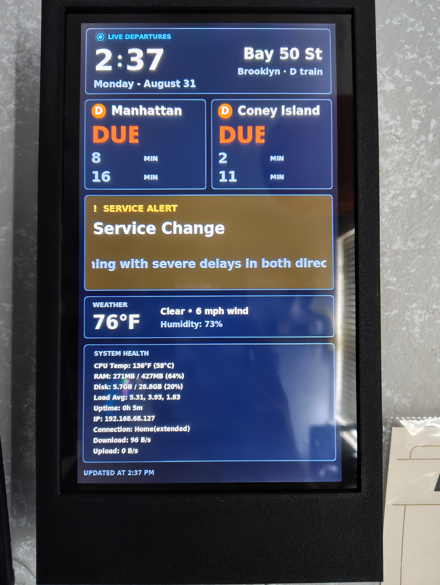
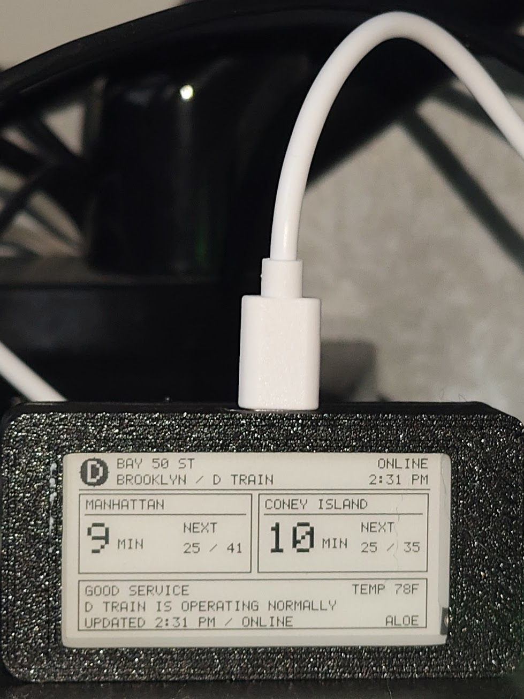

# Train UI

### A live NYC train display I built in two sizes

---

## Overview

I built Train UI so I could see the next trains without opening an app. Pick a train and station once, then leave the display running.

## How it works

Both versions connect directly to the MTA's public realtime feeds. Your train and station stay saved on the device, which refreshes arrivals, service status, weather, time, and connection information without a phone app, account, or API key.

## Choose a version

| Train UI XL | Train UI Mini |
| --- | --- |
|  |  |
| Raspberry Pi Zero W and a 10.1-inch color screen | ESP32-S3 and a 2.13-inch e-paper screen |
| Full dashboard, weather, and Pi health | Smaller, cheaper, and simpler |
| [Build the XL](Train%20UI%20XL/) | [Build the Mini](Train%20UI%20Mini/) |

## XL CAD files

| File | Use |
| --- | --- |
| [case for screen.step](Train%20UI%20XL/CAD/case%20for%20screen.step) | Full STEP assembly for reference and editing |
| [Only 3DP files.step](Train%20UI%20XL/CAD/Only%203DP%20files.step) | **Only the parts that need to be 3D printed** |
| [case for screen.f3z](Train%20UI%20XL/CAD/case%20for%20screen.f3z) | Editable Fusion 360 archive |

Use **Only 3DP files.step** when you only want the printable enclosure pieces. It leaves out the reference electronics and hardware from the full assembly.

## What they show

- Arrivals in both directions
- MTA service status and alerts
- Weather, time, and connection status
- Live public data with no API key
