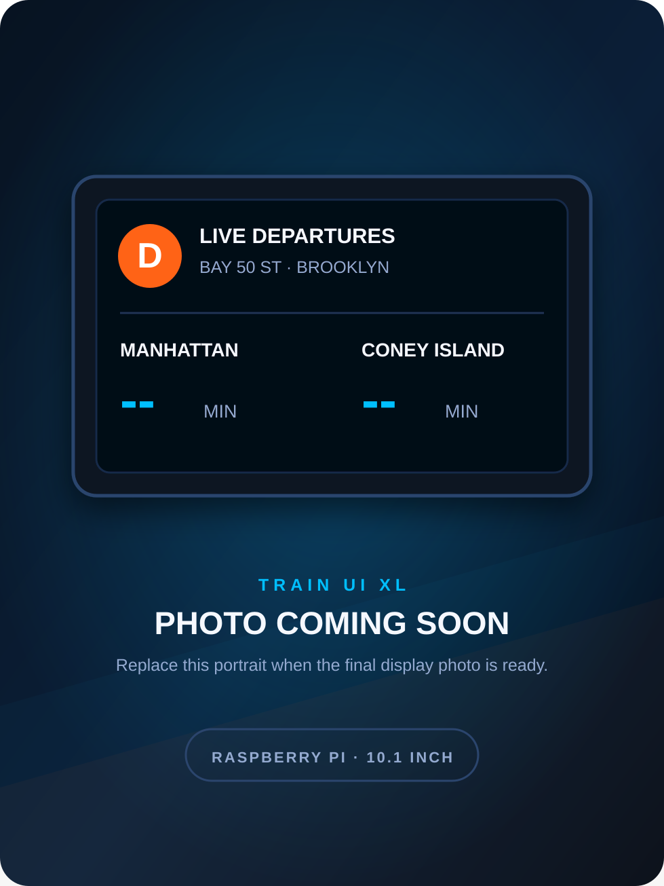

# Train UI

### A live NYC train display I built in two sizes

---

## Overview

I built Train UI so I could see the next trains without opening an app. Pick a train and station once, then leave the display running.

## Choose a version

| Train UI XL | Train UI Mini |
| --- | --- |
|  |  |
| Raspberry Pi Zero W and a 10.1-inch color screen | ESP32-S3 and a 2.13-inch e-paper screen |
| Full dashboard, weather, and Pi health | Smaller, cheaper, and simpler |
| [Build the XL](Train%20UI%20XL/) | [Build the Mini](Train%20UI%20Mini/) |

## What they show

- Arrivals in both directions
- MTA service status and alerts
- Weather, time, and connection status
- Live public data with no API key
