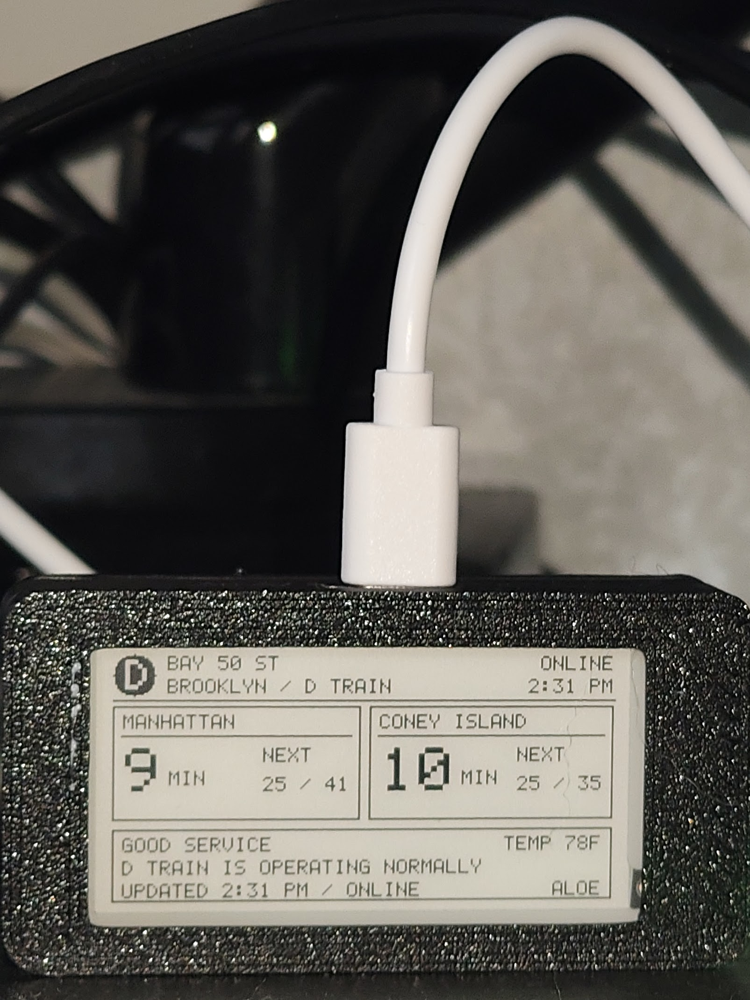

# Train UI Mini

### My small e-paper NYC train display

---

## Overview

I built Train UI Mini as a cheaper version of [Train UI XL](../Train%20UI%20XL/). It shows arrivals, service status, temperature, time, and connection status on one ESP32-S3 e-paper board.

## Parts

| Qty. | Part |
| --- | --- |
| 1 | [Elecrow CrowPanel ESP32-S3 2.13-inch e-paper display](https://www.amazon.com/dp/B0H25DMJ8M) |
| 1 | USB-C data cable |
| Optional | [3D-printed desk case](https://www.printables.com/model/1566902-case-for-crowpanel-213-epaper/related) |

## Setup

1. Install **esp32 by Espressif Systems** in Arduino IDE.
2. Open `TrainUIMiniCode/TrainUIMiniCode.ino`.
3. Use these settings and upload:

| Setting | Value |
| --- | --- |
| Board | ESP32S3 Dev Module |
| Flash Size | 8MB (64Mb) |
| PSRAM | OPI PSRAM |
| USB CDC On Boot | Enabled |

On first boot, join **TrainUIMini** with password **TRAINUI1**. Open `http://192.168.4.1`, enter your Wi-Fi, and choose a train and station.

## Controls

| Control | Action |
| --- | --- |
| Menu | Open setup again |
| Dial press | Switch between live and sample data |
| Back | Refresh |

The board uses public MTA and Open-Meteo data. No app, account, server, or API key is needed.

Train UI Mini is available under the [MIT License](LICENSE).
