

# Train UI XL Assembly Guide

### Build the enclosure in four steps

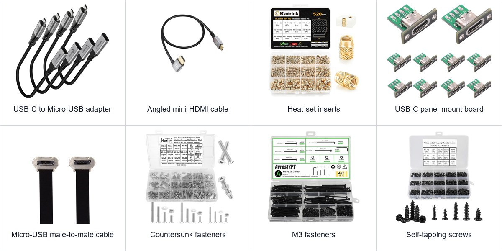

[Parts](../README.md#parts) • [Faceplate](#step-1--prepare-the-front-faceplate-and-install-the-screen) • [Pi](#step-2--prepare-the-middle-plate-and-mount-the-raspberry-pi-zero-w) • [Power](#step-3--build-and-install-the-usb-c-power-inlet) • [Close](#step-4--square-and-close-the-enclosure)

---

I designed the case as a front faceplate, middle plate, and back plate. Check the [bill of materials](../README.md#parts) before starting.

> [!WARNING]
> Keep power disconnected while cutting, stripping, soldering, or checking wiring. Keep heat away from the screen, cables, and circuit boards.

## Step 1 — Prepare the front faceplate and install the screen

**Parts:** front faceplate, 4 M3 × 4 mm heat-set threaded inserts, heat-set tip, and 10.1-inch display.

### 1. Install the inserts

The empty corner holes look like this:

  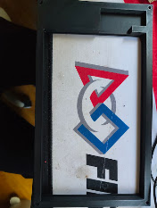

Heat one insert at a time. Press it straight in until flush, remove the tip without twisting, and let it cool. Repeat at all four corners.

  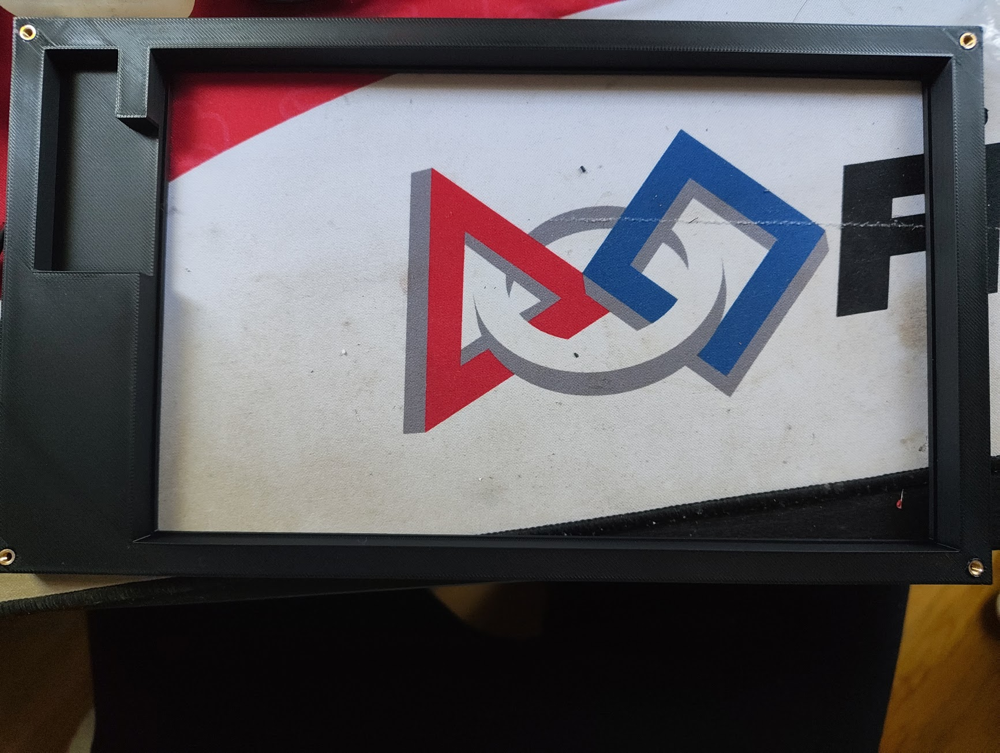

### 2. Seat the screen

Place the faceplate front-down on a soft surface. Lower the screen in from the rear with its viewing side toward the front. Keep pressure off the LCD, controller, and ribbon cable. The screen should sit flat inside the recessed edge.

  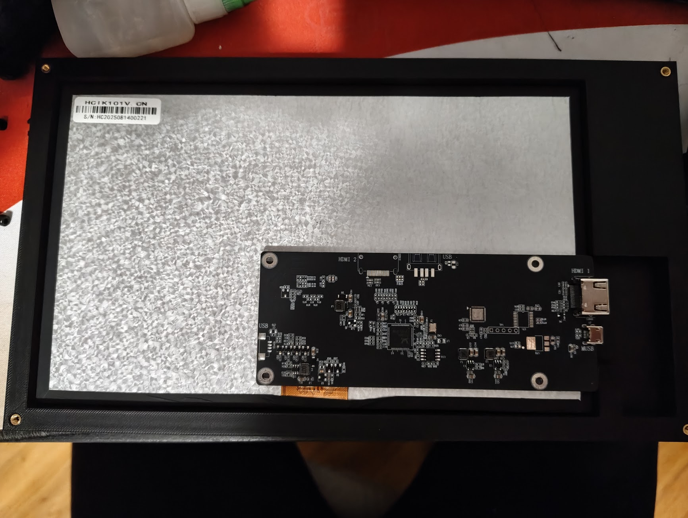

## Step 2 — Prepare the middle plate and mount the Raspberry Pi Zero W

**Parts:** middle plate, 4 M2 × 4 mm heat-set threaded inserts, heat-set tip, Pi Zero W, and four matching M2 screws.

### 1. Install the Pi inserts

Orient the plate with the large opening at the upper left. Use the four small holes grouped at the bottom left—not the larger enclosure holes.

  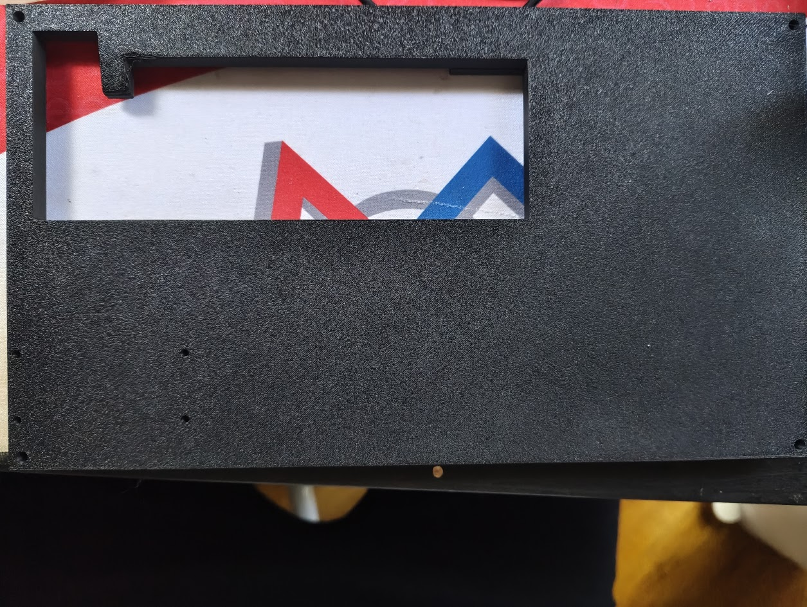

Press each insert straight in until flush and let it cool.

  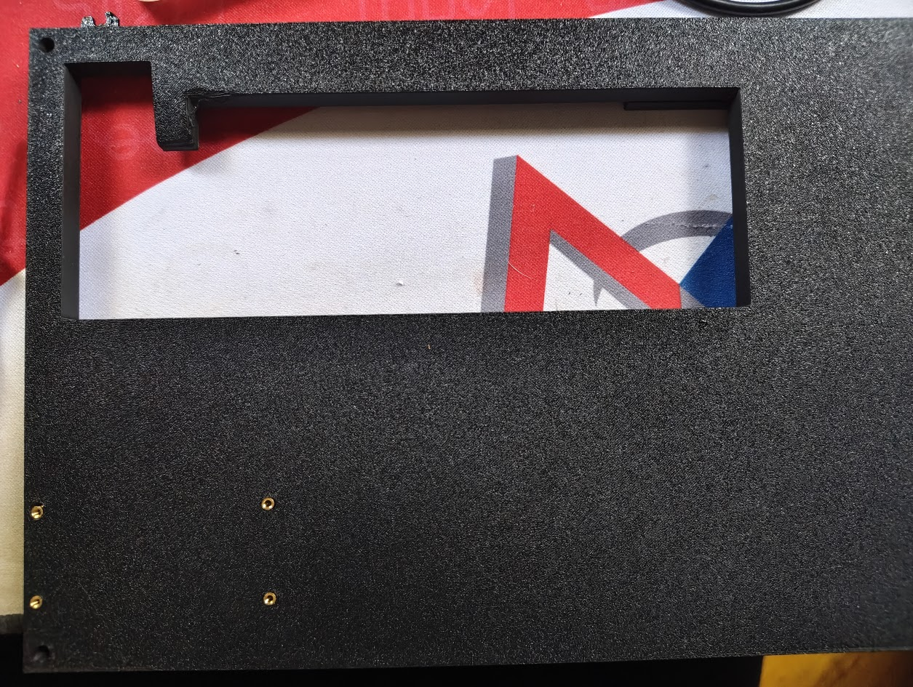

### 2. Mount the Pi

Start all four M2 screws, then tighten only until secure.

> [!IMPORTANT]
> Match the photo exactly or the back plate will not fit correctly. With the display controller at the bottom, the Pi sits at the upper right. Its green underside faces out and its connector edge points down.

Route the HDMI and power cables below the back-plate edge.

  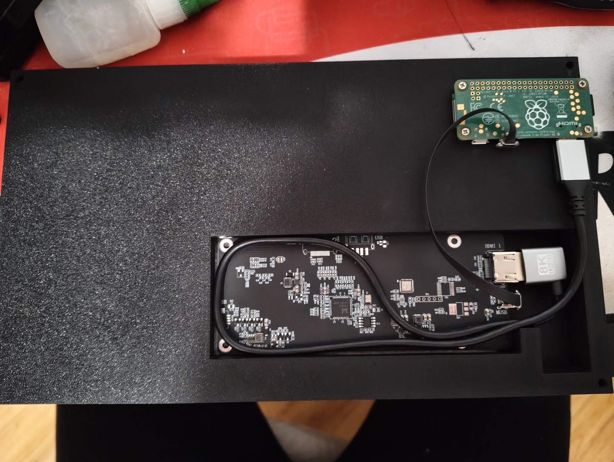

## Step 3 — Build and install the USB-C power inlet

**Parts:** back plate, USB-C panel-mount board, sacrificial Micro-USB lead, cutters, strippers, soldering iron, multimeter, insulation, and mounting screws.

### 1. Feed the cable

Cut off the unwanted end and keep the Micro-USB male plug. Strip the cut end. Insulate any unused wires.

Feed the cut end through the small back-plate opening **before soldering**. Keep the Micro-USB plug inside and the loose USB-C board outside. The molded plug cannot pass through this hole.

  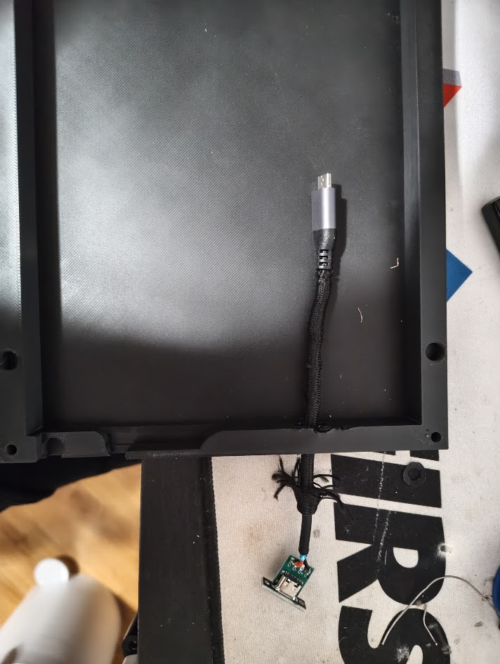

### 2. Solder and mount the inlet

- Solder the **red wire to `V`**.
- Solder the **black wire to `G`**.
- Leave `D+` and `D-` empty.

Verify the wires with a multimeter, insulate the joints, and confirm `V` is not shorted to `G`. Then bolt the USB-C board into the back plate with the socket facing outside.

  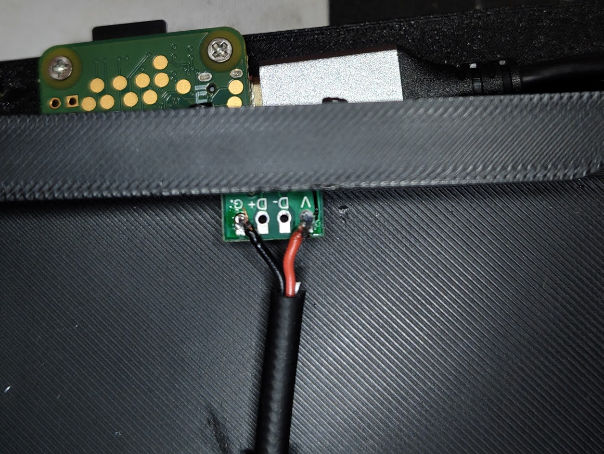

### 3. Connect Pi power

> [!IMPORTANT]
> Plug the Micro-USB end into **`PWR IN`**, not the `USB`/OTG port. This cable carries power only.

Keep the cable loop low and away from the case edges and screw holes.

  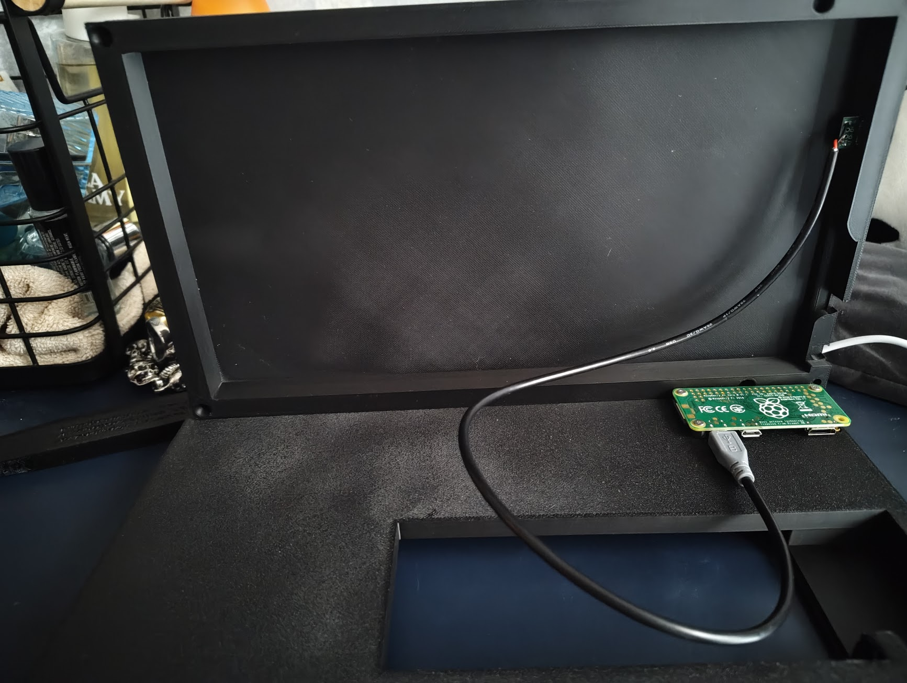

## Step 4 — Square and close the enclosure

**Parts:** the three finished layers, 4 M3 × 25 mm screws, matching tool, and a flat table.

### 1. Check the cables

Keep the build unplugged. Clear the perimeter and all four screw paths; no cable may cross an edge. If the plates do not close with light hand pressure, reopen them and move the obstruction. Never use the screws to force the case shut.

### 2. Square the case

Stand the case on one side on a flat table, with its faces approximately 90 degrees to the tabletop. Press the layers together until the edges and holes align. Keep pressure off the display.

Start all four M3 × 25 mm screws a few turns. Tighten them gradually across opposite corners until the seams close. Do not overtighten the inserts.

  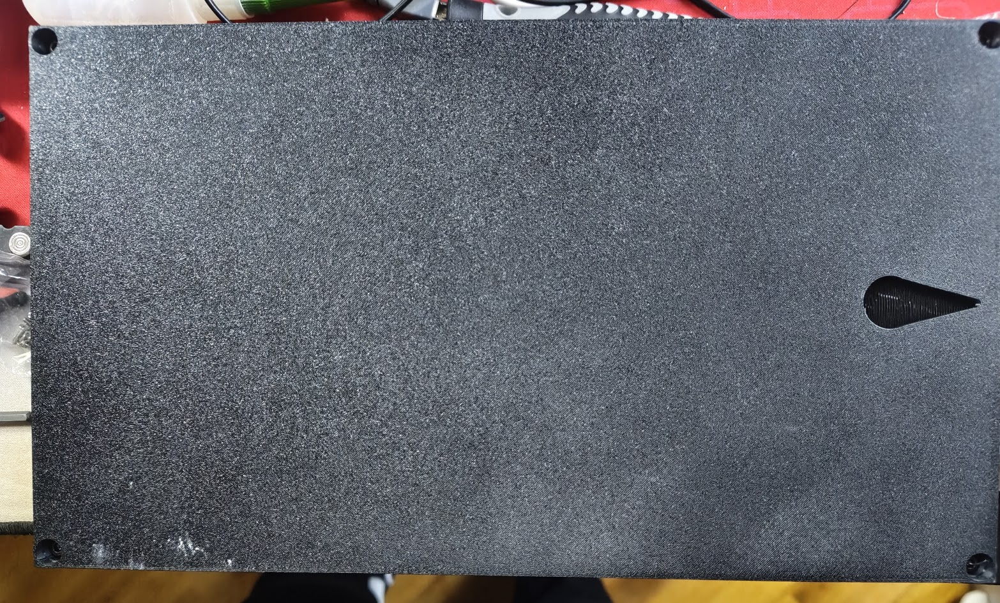

Check every seam once more. If no cable is trapped and the USB-C inlet is clear, the build is finished.
